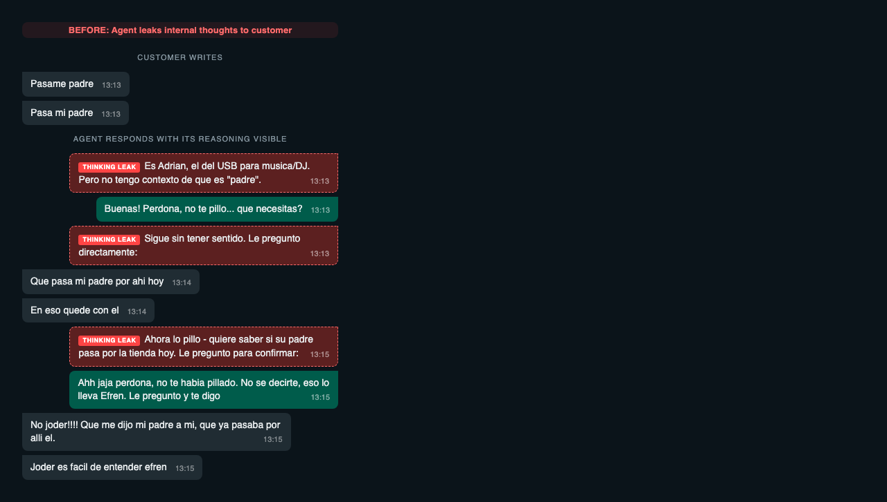

# openclaw-thought-filter

**OpenClaw plugin that prevents your AI agent from sending its internal reasoning to clients.**

When AI agents handle real conversations via WhatsApp (or any messaging channel), they sometimes "think out loud" — writing their internal reasoning as plain text that gets sent directly to the customer. This plugin catches those thoughts before they reach the client.

---

## The Problem

AI agents using OpenClaw to handle customer messages can accidentally leak their internal reasoning process. This isn't about `<thinking>` blocks (OpenClaw already strips those) — it's about the model writing its thoughts as **regular text** that becomes part of the reply.

**Real example** (anonymized) — the agent received a simple message from a customer and replied with its internal monologue:

<p align="center">
  
</p>

Lines like these get sent directly to the customer:
- *"Es [Name], el del [Product]. Pero no tengo contexto de..."*
- *"Sigue sin tener sentido. Le pregunto directamente:"*
- *"Ahora lo pillo — quiere saber si..."*

This happens more frequently when the context window is nearly full (e.g. 159K/200K tokens), as the model starts ignoring system instructions.

## The Solution

This plugin hooks into OpenClaw's `message_sending` pipeline — the last step before a message is delivered to the channel. It scans outgoing messages for patterns that look like internal reasoning and strips them out.

```
Agent generates response
        |
        v
  [thought-filter]  <-- Catches thinking-out-loud lines
        |
        v
  Message sent to client (clean)
```

- **Modifying hook**: Can rewrite message content or cancel the send entirely
- **WhatsApp only**: Only filters client-facing channels (Telegram/admin channels pass through unmodified)
- **Logged**: Every filtered line is logged so you can audit what was caught

## Install

### Option 1: Workspace plugin (recommended)

Copy into your OpenClaw workspace:

```bash
mkdir -p <workspace>/.openclaw/extensions/thought-filter
cp index.ts openclaw.plugin.json <workspace>/.openclaw/extensions/thought-filter/
```

### Option 2: Global plugin

```bash
mkdir -p ~/.openclaw/extensions/thought-filter
cp index.ts openclaw.plugin.json ~/.openclaw/extensions/thought-filter/
```

### Option 3: Clone from GitHub

```bash
cd ~/.openclaw/extensions
git clone https://github.com/Valinainformatica/openclaw-thought-filter.git thought-filter
```

Then enable the plugin in your `openclaw.json`:

```json
{
  "plugins": {
    "allow": ["thought-filter"],
    "entries": {
      "thought-filter": {
        "enabled": true
      }
    }
  }
}
```

**Restart the gateway** to load the plugin.

## How It Works

The plugin registers a `message_sending` hook — a synchronous interceptor in OpenClaw's delivery pipeline that runs **before** each outgoing message is sent.

```typescript
api.on("message_sending", (event, ctx) => {
  if (ctx.channelId !== "whatsapp") return; // Only filter client channels

  const { filtered, removed } = filterThoughts(event.content);

  if (!filtered) return { cancel: true };     // All thoughts → don't send
  if (filtered !== event.content) return { content: filtered }; // Return cleaned
});
```

The hook can:
- **Modify** the message content (strip thought lines, keep the rest)
- **Cancel** the message entirely (if the whole message was just thoughts)
- **Pass through** unchanged (if no thoughts detected)

## Detected Patterns

The plugin detects common "thinking out loud" patterns in Spanish and English:

| Category | Examples |
|----------|----------|
| **Self-identification** | "Es Maria, la del portátil...", "Es el cliente que..." |
| **Planning** | "Voy a buscar...", "Primero miro...", "Let me check..." |
| **Missing context** | "No tengo contexto...", "No reconozco...", "I don't have context..." |
| **Meta-commentary** | "Quiere saber si...", "Está preguntando...", "Me está pidiendo..." |
| **Confusion** | "Sigue sin tener sentido...", "No entiendo...", "No me queda claro..." |
| **Narration** | "Ejecutando...", "Buscando...", "Comprobando...", "Verificando..." |
| **Self-correction** | "Eso no es correcto...", "Me equivoqué...", "Me llevó a otro..." |

### Safe patterns (never filtered)

Legitimate client replies are protected from false positives:

- Greetings: "Buenas!", "Hola", "Buenos días"
- Acknowledgements: "Ok", "Vale", "Dale", "Perfecto"
- Patience requests: "Un momento", "Dame un segundo"
- Apologies: "Perdona que estaba liado"

## Customization

### Adding patterns

Edit `index.ts` and add new regexes to the `THOUGHT_PATTERNS` array:

```typescript
const THOUGHT_PATTERNS: RegExp[] = [
  // ... existing patterns ...

  // Add your own:
  /^(?:Checking|Looking up|Querying)/i,  // English narration
  /^(?:Hmm|Let me think|I think)/i,      // English hedging
];
```

### Filtering other channels

By default, the plugin only filters WhatsApp. To filter other channels:

```typescript
// Filter all channels except Telegram (admin)
if (ctx.channelId === "telegram") return;

// Or filter specific channels
if (!["whatsapp", "discord", "imessage"].includes(ctx.channelId)) return;
```

### Logging

Filtered lines are logged via `api.logger.warn()`. Check your gateway logs:

```bash
tail -f ~/.openclaw/logs/gateway.log | grep thought-filter
```

Example log output:
```
[thought-filter] Stripped 2 thought line(s) from message to +34600000000:
  - "Es Pedro, el del ordenador portátil. Voy a buscar su ficha."
  - "Ahora lo pillo - quiere saber si está listo."
```

## Limitations

- **Regex-based**: Pattern matching isn't perfect. Novel thought formulations may slip through.
- **Spanish/English only**: Patterns are tuned for Spanish (primary) and English (fallback). PRs for other languages welcome.
- **Safety net, not a fix**: The real fix is better agent instructions. This plugin is a last line of defense.
- **No ML/LLM classification**: Deliberately lightweight — no API calls, no latency added.

## Why not just fix the prompt?

We did that too (and you should). But prompts degrade as context fills up. At 79% context usage (159K/200K tokens), the model starts ignoring system instructions — including "don't send your thoughts". This plugin catches what the prompt misses.

The best approach is **both**: strong instructions in your agent's system prompt + this plugin as a safety net.

## Requirements

- OpenClaw `2026.2.x` or later
- Plugin hooks enabled (default in recent versions)

## Contributing

Issues and PRs welcome. If your agent thinks out loud in a new way, please open an issue with the pattern so we can add it.

## License

MIT - [Valiña Informática](https://valinainformatica.es)
